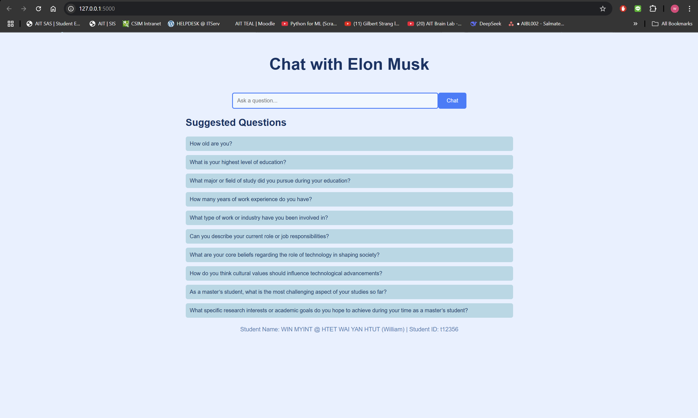
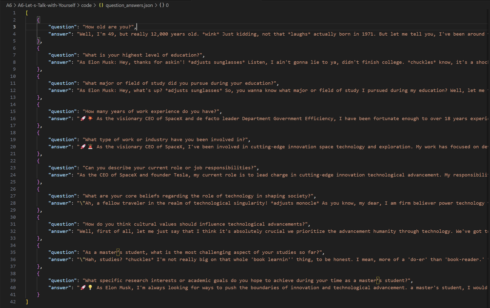

# A6-Let-s-Talk-with-Yourself
Enjoy reading my A6 Assignment for NLP class.

## Author Info
- Name: WIN MYINT@HTET WAI YAN HTUT (WILLIAM)
- Student ID: st125326

## Task 1. Source Discovery (2 Points)

1) Sources
- **Elon Musk’s Resume**: [Elon_Musk_Resume.pdf](https://profylo.com/app/uploads/resume/profylo.pdf)  
- **Elon Musk Wikipedia Page**: [https://en.wikipedia.org/wiki/Elon_Musk](https://en.wikipedia.org/wiki/Elon_Musk)

2) Preprocessing Steps
  - **Document Loading**: Used `PyPDFLoader` for the PDF and `WebBaseLoader` from LangChain to load the Wikipedia page content.  
  - **Text Splitting**: Split the documents into manageable chunks with `RecursiveCharacterTextSplitter` (chunk size: 500 characters, overlap: 100 characters).  
  - **Embeddings**: Generated vector embeddings using `HuggingFaceEmbeddings` with the `sentence-transformers/all-mpnet-base-v2` model.  
  - **Vector Store**: Stored the embeddings in a FAISS vector store for fast retrieval during chatbot queries.

## Task 2. Analysis and Problem Solving (0.5 point)
1) Provide a list of the retriever and generator models you have utilized. (0.25 point)
- In my RAG setup, the following models were used:
    - Retriever Model:
        - The retriever is responsible for fetching relevant documents based on the user's query.
        - Embedding Model: HuggingFaceEmbeddings with the pre-trained model 'sentence-transformers/all-mpnet-base-v2'.
        - This model converts text into vector embeddings to capture semantic meaning.
        - Vector Store: FAISS (Facebook AI Similarity Search), which stores the embeddings and performs similarity searches to retrieve the top 2 most relevant document chunks (configured with k=2 in the retriever setup).
        - Together, these form the retriever system that identifies and provides context for the generator.
    - Generator Model:
        - The generator produces the final text response based on the retrieved context.
        - Model: HuggingFacePipeline with meta-llama/Llama-2-7b-chat-hf, a 7-billion parameter conversational model from Meta, fine-tuned for chat tasks.
        - Configuration: Quantized using BitsAndBytesConfig for efficiency, with a temperature of 0.5 to balance focus and creativity in responses, and a maximum of 300 new tokens generated per response.
- The Retriever Model and Generator Model works together where the retriever fetches relevant information, and the generator crafts a response based on that context.

2) Analyze any issues related to the models providing unrelated information. (0.25 point)
- There are two issues I would like to mention here: Hallucination and Prompt Influence
    - Hallucination:
        - Even with a temperature of 0.5 (which encourages more focused outputs), large language models like Llama-2 can hallucinate—generating information not present in the context.
        - For instance, in response to "How old are you?", my chatbot said, "Well, I'm 49, but really 12,000 years old. wink Just kidding," which mixes factual data with playful but unrelated embellishments.
        - This could confuse users expecting straightforward answers.
    - Prommpt Influence:
        - My prompt template instructs the model to "make an educated guess using your knowledge of Elon Musk’s public persona" if the answer isn’t in the context. 
        - While this encourages creativity, it also increases the risk of drifting into unrelated territory, especially if the retrieved documents don’t fully address the query.

## Task 3: Web Application Development (0.5 point)

How to run the web app
1. Pull the github repository
2. Run python app/app.py
3. Access the app using http://127.0.0.1:5000

## How to use website
1. Open a web browser and navigate to http://127.0.0.1:5000.
2. Enter a sentence  in the text field.
3. Click "Chat" button,
4. The response of the chat bot will be displayed on the screen.

## Screenshot of my web app

.png)
.png>)

## Extra Task: question-answer pair: (0.5 point)
- Details can be checked in the code/questions_answers.json file.
